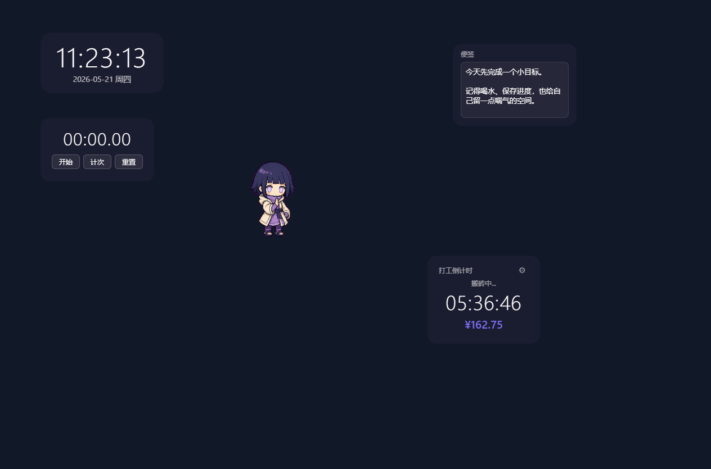
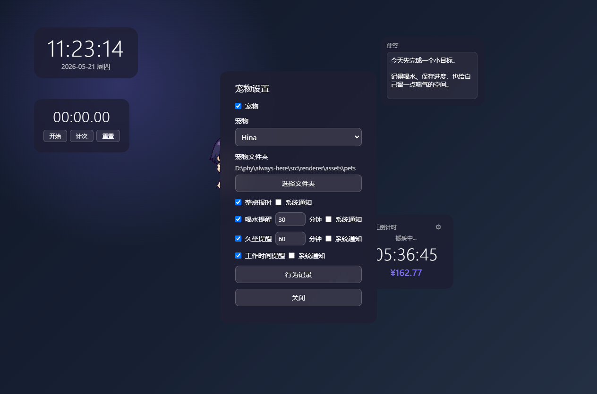
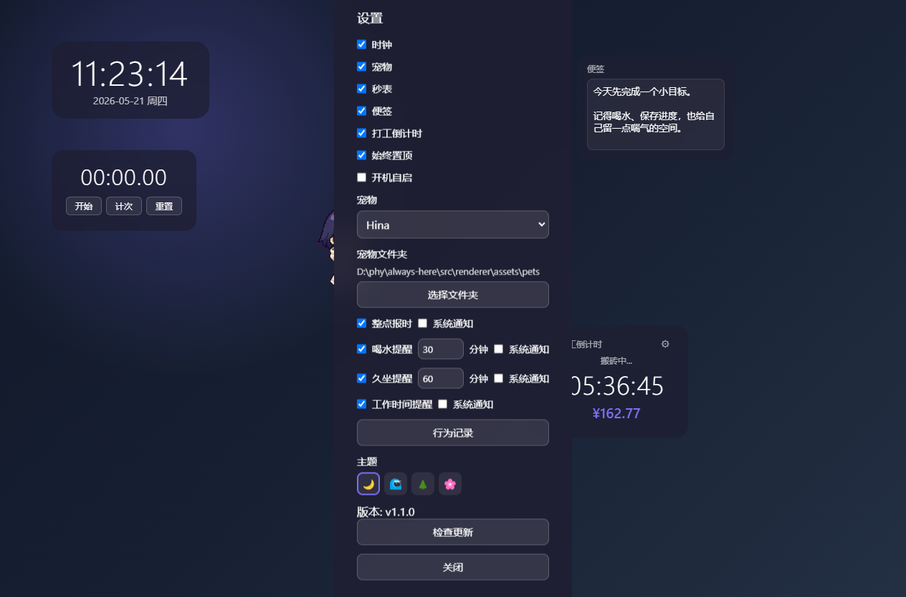

# Always Here

Always Here 是一款基于 Electron 开发的轻量级桌面陪伴工具。它把时钟、秒表、便签、桌面宠物、喝水/久坐提醒和“打工倒计时”放在一个始终可见但不打扰的桌面层里，让日常工作多一点秩序和陪伴感。

## 📸 应用截图

### 桌面挂件总览



### 宠物专属设置



### 全局设置



## 🌟 主要特性

-   **多功能挂件系统**:
    -   **时钟 (Clock)**: 简洁的桌面时间显示。
    -   **秒表 (Timer)**: 支持计次功能的桌面秒表。
    -   **便签 (Note)**: 随时记录灵感与待办。
    -   **打工倒计时 (Wageman)**: 实时计算今日薪资进度，支持工作日自动识别与下班提醒。
-   **桌面宠物 (Pet)**: 
    -   支持多种宠物切换。
    -   拥有丰富的动画、可调频率闲聊和提醒功能（喝水、久坐、整点报时）。
    -   支持安静模式，暂停宠物闲聊，降低工作时的打扰。
    -   支持自定义外部宠物素材文件夹。
    -   更多宠物素材可以在 [Codex Pets](https://codex-pets.net/) 下载。
-   **高度自定义**: 支持置顶显示、点击穿透切换、透明度调节以及多种精美主题皮肤。
-   **组件专属设置**: 每个挂件右键只显示自己的设置，全局设置保留在系统托盘菜单中。
-   **行为记录**: 记录并分析你的日常互动行为。
-   **极速热更新**: 采用自定义 ASAR 替换技术，无需下载百兆安装包即可秒级完成功能升级。

## 🚀 快速开始

### 开发环境运行
1. 克隆仓库。
2. 安装依赖:
   ```bash
   npm install
   ```
3. 启动应用:
   ```bash
   npm start
   ```

### 生产打包
生成 Windows 安装包:
```bash
npm run build
```
*注：由于使用了符号链接，在 Windows 上打包可能需要开启“开发者模式”或以管理员权限运行。*

## 🛠️ 技术栈

-   **框架**: Electron
-   **前端**: 原生 HTML5 / CSS3 / JavaScript (ES Module)
-   **持久化**: 本地 JSON 文件配置
-   **打包工具**: electron-builder

## 🔄 热更新机制

本项目实现了一套针对 Windows 环境优化的 **ASAR 热替换方案**：
- **原理**: 仅下载更新业务代码包 (`app.asar`)，通过脚本在应用重启时自动覆盖，避免了 Electron 内核（Chromium/Node.js）约 80MB 的重复下载。
- **配置**: 修改 `src/updater.js` 中的 `UPDATE_CHECK_URL` 为你的版本检查接口。
- **接口规范**:
  ```json
  {
    "version": "1.1.0",
    "asar": "https://your-server.com/app.asar",
    "description": "更新日志详情"
  }
  ```

## 📂 项目结构

- `src/main.js`: 主进程入口，处理窗口管理与系统交互。
- `src/updater.js`: 热更新核心逻辑。
- `src/renderer/`: 渲染进程代码。
  - `widgets/`: 各个挂件的独立组件。
  - `utils/`: 通用工具函数（配置管理、拖拽实现等）。
- `test/`: 单元测试目录。

## ⚖️ 开源协议

本项目采用 [ISC License](LICENSE) 开源。
